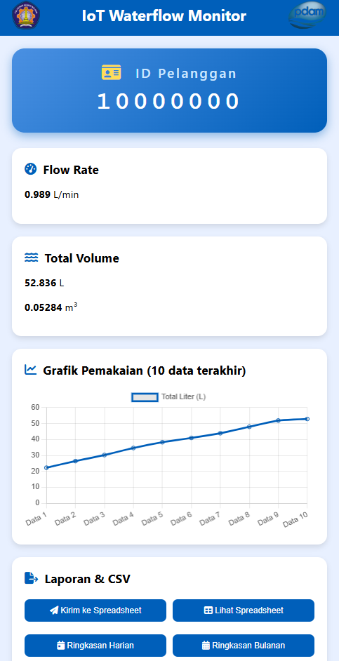

# 🎯 GUIDE - CARA MENGGUNAKAN FITUR BARU PORTFOLIO

## 📱 MOBILE MENU (Hamburger)

### Cara Kerja
- Di desktop: Menu horizontal normal
- Di mobile (< 768px): Menu berubah jadi hamburger button

### Tombol Hamburger
```html
<div class="hamburger" id="hamburger">
  <span></span>
  <span></span>
  <span></span>
</div>
```

Menu otomatis menutup saat klik link. Tidak perlu setup tambahan!

---

## 🎬 MODAL GALLERY

### Membuka Modal
```html
<button class="btn-view" onclick="openModal('modal1')">
  <i class="fas fa-eye"></i> Detail Proyek
</button>
```

### Slider di Dalam Modal
Modal 1, 3, 4 sudah punya multiple images. Contoh:
```html

  <!-- tambah gambar di sini -->
```

Dots (indicator) otomatis muncul dan bisa diklik!

### Menutup Modal
Klik:
- Button X (close button)
- Area gelap di luar modal
- Atau tekan ESC (akan ditambah jika perlu)

---

## 🔍 IMAGE ZOOM

### Cara Kerja
Klik di gambar manapun dengan class `zoomable`:
```html

```

Otomatis muncul overlay zoom yang besar!

### Menutup Zoom
Klik:
- Button X (close-zoom)
- Area gelap di sekitarnya

---

## 📋 UPDATE INFORMASI CONTACT

### Email
Cari di `index.html`:
```html
<a href="mailto:ekoramadan53@gmail.com">ekoramadan53@gmail.com</a>
```

Ganti dengan email Anda.

### Telepon
```html
<a href="tel:+6282240374298">+62 8224-0374-298</a>
```

Ganti dengan nomor Anda.

### Format Telepon
Gunakan format: `+62` + nomor (tanpa 0 di awal)

---

## 🔗 UPDATE GITHUB LINKS

### Mencari Tempat
Setiap modal punya section:
```html
<a href="https://github.com/username/proyek-name" target="_blank">
  <i class="fab fa-github"></i> Lihat di GitHub
</a>
```

### Update
Ganti:
- `username` → username GitHub Anda
- `proyek-name` → nama repository project

### Contoh
```html
<a href="https://github.com/ekoramadhan/IoT-PDAM-Monitor" target="_blank">
```

---

## 🖼️ MENAMBAH GAMBAR PROJECT

### Satu Gambar
Modal sudah ada yang single image:
- Modal 2 (Air Otomatis)
- Modal 5 (Personal Tracker)

Cukup update tag ``:
```html

```

### Multiple Gambar (Slider)
Modal dengan multiple images: Modal 1, 3, 4

Tambahkan `` baru:
```html
<div class="slides">
  
  
    <!-- tambah di sini -->
</div>
```

Dots otomatis bertambah!

---

## 🎨 CUSTOMIZE WARNA

### File: `style.css`

Cari angka warna hex ini:
```css
#667eea  → Warna indigo (primary)
#764ba2  → Warna purple (secondary)
```

Ganti dengan warna favorit Anda!

### Contoh Kombinasi Warna Lain:
```css
Blue to Cyan:     #3b82f6 ke #06b6d4
Green to Teal:    #10b981 ke #14b8a6
Orange to Pink:   #f97316 ke #ec4899
Red to Orange:    #ef4444 ke #f97316
```

---

## 📝 EDIT DESKRIPSI PROJECT

### Lokasi
Di masing-masing `<div id="modalX">`, cari:
```html
<div class="modal-section">
  <h3>Deskripsi</h3>
  <p>Masukkan deskripsi project Anda di sini...</p>
</div>
```

### Tips Menulis Deskripsi
✅ Jelaskan problem yang dipecahkan
✅ Describe solusi Anda
✅ List teknologi yang digunakan
✅ Highlight fitur utama
✅ Keep it concise (2-3 paragraf)

---

## 🎯 MENGUBAH HERO TEXT

### Lokasi
```html
<h1 class="hero-title">Mochamad Eko Ramadhan</h1>
<p class="hero-subtitle">Electronics Engineering | IoT & Web Developer</p>
<p class="hero-desc">Fresh graduate yang passionate...</p>
```

### Tips
- Nama tetap singkat
- Subtitle highlight expertise Anda
- Description jelaskan passion/goal

---

## 🖨️ TESTING CHECKLIST

### Desktop Testing
- [ ] Hover effects bekerja
- [ ] Modal buka/tutup smooth
- [ ] Slider berfungsi
- [ ] Links bekerja semua
- [ ] Scroll smooth

### Mobile Testing (Buka DevTools F12)
- [ ] Hamburger menu muncul
- [ ] Menu toggle berfungsi
- [ ] Layout 1 column
- [ ] Fonts readable
- [ ] Buttons besar cukup
- [ ] Modal responsive
- [ ] Zoom berfungsi

### Devices Testing
- [ ] iPhone (375px)
- [ ] iPad (768px)
- [ ] Android (360px)
- [ ] Desktop (1920px)

---

## ⚡ PERFORMANCE TIPS

### Image Optimization
1. Gunakan TinyPNG (tinypng.com)
2. Ideal size:
   - Profile photo: 300x400px
   - Project images: 800x600px
   - Keep under 200KB each

### Loading
Semakin kecil file, semakin cepat loading!

### Check Speed
- Google PageSpeed Insights
- GTmetrix
- WebPageTest

---

## 🚀 DEPLOYMENT

### GitHub Pages (Free)
1. Push code ke GitHub
2. Settings → Pages
3. Select main branch
4. Website live!

### Netlify (Free)
1. Drag & drop folder ke netlify.com
2. Auto-deploy ready
3. Custom domain available

### Hosting Lokal
- Gunakan Live Server extension di VS Code
- Right-click `index.html` → "Open with Live Server"

---

## 🐛 TROUBLESHOOTING

### Modal tidak buka
**Check:**
- ID di button match ID di modal
- onclick="openModal('modalX')" tepat
- Modal ada di HTML

### Hamburger menu tidak work
**Check:**
- `hamburger` & `navLinks` ID ada
- `script.js` loaded (buka DevTools Console)

### Gambar tidak tampil
**Check:**
- Filename tepat (case-sensitive)
- File ada di folder yang sama
- Format benar (.png, .jpg, .jpeg)

### Warna tidak berubah
**Check:**
- CSS syntax benar: `#hexcode`
- Refresh browser (Ctrl+Shift+R)
- Check spelling

---

## 💡 PRO TIPS

1. **Backup Original**
   - Simpan copy HTML/CSS sebelum edit besar

2. **Use DevTools**
   - F12 untuk inspect elements
   - Edit CSS real-time di browser

3. **Semantic HTML**
   - Already done! Tetap jaga struktur

4. **CSS Organization**
   - Sudah terorganisir per section
   - Keep it that way

5. **Testing Reguler**
   - Test setiap kali ada perubahan
   - Cross-browser testing

---

## 📞 NEED HELP?

Jika menemukan issue:
1. Check console (F12 → Console tab)
2. Lihat error message
3. Compare dengan contoh di sini
4. Validate HTML (validator.w3.org)

---

**Happy Coding! 🚀**

Portfolio Anda siap untuk impressive employer/klien! 💼✨
